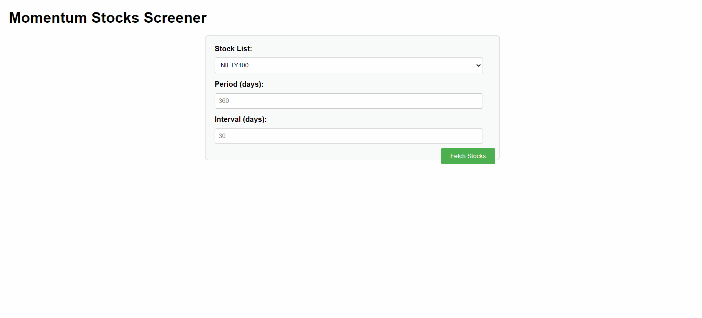

# Momentum Stocks Filter Web Application

This project is a web application that allows users to analyze and screen stocks based on momentum strategy. It consists of a Flask backend for data processing and a simple HTML/JavaScript frontend for user interaction.
The back-test of the proposed strategy was done and it was foud to beat the Indian benchmark Index NIFTY50 by over 400% in the past 4 years (begining Dec 2020). Feel free to ask for the code for the same via e-mail if interested. 

## Table of Contents
1. [Demo](#demo)
2. [Features](#features)
3. [Technologies Used](#technologies-used)
4. [Setup and Installation](#setup-and-installation)
5. [Usage](#usage)
6. [How It Works](#how-it-works)
7. [Contributing](#contributing)
8. [License](#license)
9. [Contact](#contact)

## Demo

## Features

- Screen stocks from predefined lists (NIFTY100, NIFTY200, NIFTY500)
- Calculate gross returns for stocks over a specified period and divided in intervals
- Categorize stocks into deciles based on their performance
- Display results in an easy-to-read table format

## Technologies Used

- Backend:
  - Python
  - Flask
  - yfinance (for fetching stock data)
  - NumPy (for statistical calculations)
- Frontend:
  - HTML
  - CSS
  - JavaScript

## Setup and Installation

1. Clone the repository:
   git clone https://github.com/yourusername/momentum-stocks-screener.git
cd momentum-stocks-screener
2. Install the required Python packages:
   pip install flask flask-cors yfinance numpy
3. Run the Flask application:
   python app.py
4. Open `index.html` in your web browser to use the application.

## Usage

1. Select a stock list from the dropdown menu (NIFTY100, NIFTY200, or NIFTY500).
2. Enter the period (in days) for which you want to analyze the stocks.
3. Enter the interval (in days) for calculating returns.
4. Click "Fetch Stocks" to run the analysis.
5. View the results in the table below, sorted by deciles.

## How It Works

1. **Data Retrieval**: The backend fetches historical stock data using yfinance for the selected stock list.
2. **Return Calculation**: Gross returns are calculated for each stock over the specified period, considering the given interval blocks.
3. **Decile Sorting**: Stocks are sorted based on their returns and categorized into deciles.
4. **Data Presentation**: The frontend receives the processed data and displays it in a user-friendly table format.

## Contributing

Contributions are welcome! Please feel free to submit a Pull Request.

## License

This project is open source and available under the [MIT License](LICENSE).

## Contact

Please feel free to drop any suggestions or comments on aryanchoudhari09@gmail.com.
